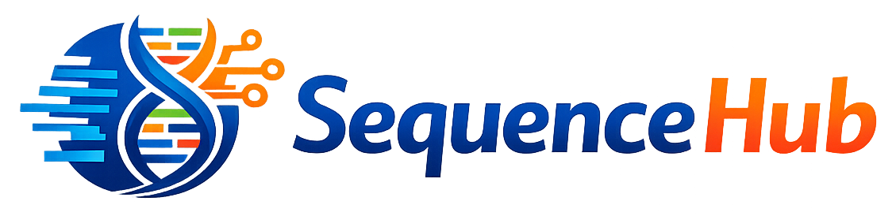

Browser-native platform for Sanger DNA sequencing analysis — built to replace
legacy desktop sequencing tools with a modern, observable, and extensible
alternative.

It reads raw capillary electrophoresis output (AB1, SRD, DAN v2–6, SCF v3), runs
a 9-stage basecalling pipeline, and renders results through a high-performance
Canvas chromatogram viewer with Q0–Q60 quality overlays. The backend is
ASP.NET Core 9 with a plugin-based processor architecture, REST + SSE job API,
and a full observability stack (Prometheus, Grafana, Loki, OpenTelemetry) bundled
in `docker-compose`. It deploys as a single Electron desktop application or scales
to a distributed multi-worker setup — same codebase, same API, mode selected by
configuration.

## Applicable Domains

The core architecture is domain-agnostic — the same processing orchestration,
file I/O model, and visualization stack apply to any multi-channel time-series
signal source:

- Sanger DNA sequencing
- Scientific instrumentation
- Analytical chemistry
- Industrial telemetry
- Signal processing platforms
- Browser-native engineering SaaS

## [👨‍💻 About the Author](about-author.html)

## [🚀  Live Demo](https://ou22-i5qc-fuai.gw-1a.dockhost.net/) 
##### Login: `seq@test` / `seq@test`

## [🧬 Platform Presentation](presentation/platform.html)

## Documentation

- [Architecture](docs/architecture.html)
- [Process communication](docs/process-communication.html)
- [Deployment](docs/deployment.html)
- [SequenceLogicData API](docs/sequence-data-api.html)
- [Screenshots](screenshots/)

## This repository

Public documentation for the SequenceHub platform. Open-source components —
including the core service, file format I/O library, and Canvas visualization
layer — are coming soon.

## Quick Start

```bash
# Vanilla JS version
docker pull pkvspb/seqview:latest

docker run -p 80:8080 pkvspb/seqview

# With sequences directory mounted
docker run -p 80:8080 -v YOUR_PATH/sequences:/app/storage/sequences pkvspb/seqview
```

Open `http://localhost` in your browser. Default credentials: `seq@admin` / `seq@admin`.

## License

Licensed under the [Apache License 2.0](LICENSE).
